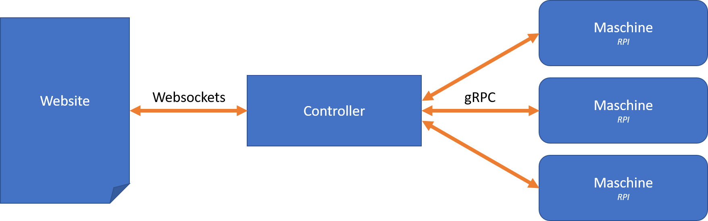

# Prototypische Demo für die Abschlusspräsentation in advanced Software Engineering

Es handelt sich um eine Maschinen- oder Anlagensteuerung, bei der dezentrale Maschineneinheiten über einen gemeinsamen Kommunikationsweg in Echtzeit gesteuert und deren Parameter visualisiert werden.

## Architektur

- Die Maschineneinheiten werden über Raspberry Pi´s dargestellt.
- Die Kommunikation zwischen den Maschinen und der zentralen Steuerung erfolgt über gRPC.
- Als Benutzerschnittstelle wird eine Webseite verwendet, welche über eine Websockets-Schnittstelle mit dem Server kommuniziert.

## Implementierung
- Die Maschinen sind in der Programmiersprache C\# implementiert.
- Die Steuerung ist mit Node.js implementiert.
